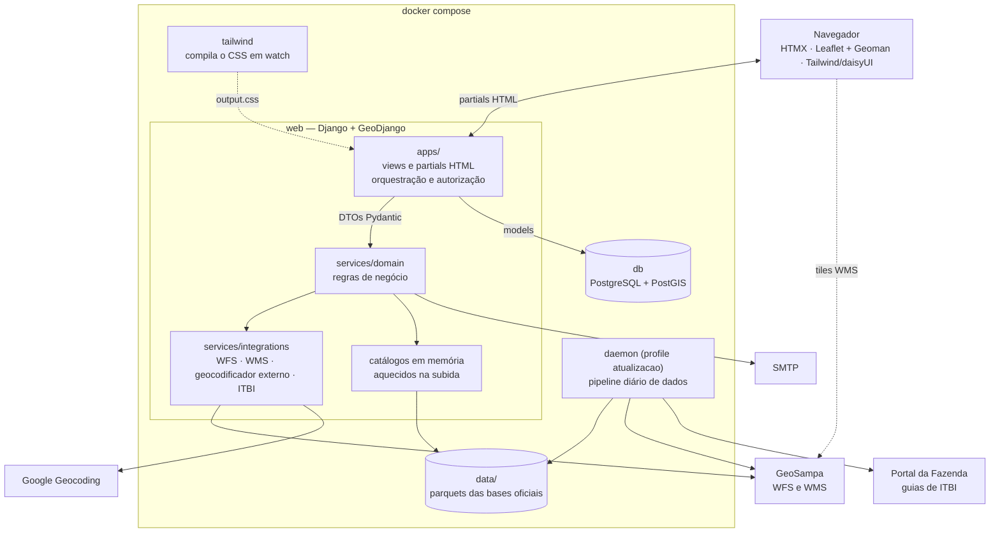

# DIMAP GeoCoder

**Do endereço ao ato administrativo, na mesma tela.**

O DIMAP GeoCoder é a plataforma em que o servidor da Divisão do Mapa de Valores (DIMAP), da
Secretaria Municipal da Fazenda de São Paulo, encontra qualquer logradouro, endereço ou lote da
cidade e resolve ali mesmo o processo de trabalho que depende dele.

- **Uma barra de busca para a cidade inteira.** Nome de rua, endereço ou número de contribuinte: o
  sistema entende o que foi digitado, sugere a cada tecla, tolera erro de grafia e mostra o
  resultado no mapa. Por trás estão as bases oficiais da Prefeitura — mais de 1,6 milhão de
  endereços fiscais e 50 mil logradouros.
- **O imóvel inteiro, logo após a busca.** Localizado o lote, o mapa mostra o polígono dele sobre a
  ortofoto do GeoSampa e uma gaveta traz seus dados cadastrais.
- **Do mapa ao documento oficial.** A certidão de existência de lançamento no IPTU sai em PDF
  timbrado, com planta de localização, QR code e selo de integridade — e qualquer pessoa confere a
  autenticidade dela, sem login.
- **Também a partir de um desenho.** Marque um polígono no mapa e o sistema lista os lotes que ele
  cruza, prontos para uma certidão do conjunto.
- **Cada ato com competência e registro.** As ações só aparecem para quem pode praticá-las, conforme
  cargo e unidade, e toda execução fica registrada: quem, com qual perfil, sobre o quê e quando.
- **Feita para crescer.** Cada processo da DIMAP entra como uma ação nova, sem mexer na busca.

## Para que foi feito

Há processos de trabalho da DIMAP que começam todos pela mesma pergunta: *onde fica, e o que é, este
imóvel?* O DIMAP GeoCoder responde a ela sobre os dados oficiais da Prefeitura e deixa o passo
seguinte — a consulta, a certidão — a um clique do resultado, com a autorização e o registro que um
ato administrativo exige.

## Quem desenvolveu

Henrique Pougy ([@h-pgy](https://github.com/h-pgy)), na Divisão do Mapa de Valores (DIMAP) do
Departamento de Cadastros (DECAD), Subsecretaria da Receita Municipal (SUREM) — Secretaria Municipal
da Fazenda da Prefeitura de São Paulo.

## Como funciona

O sistema encadeia três camadas:

1. **Localização.** Uma barra de pesquisa única infere o que foi digitado (nome ou código de
   logradouro, endereço, número de contribuinte), sugere resultados a cada tecla e desenha a
   geometria num mapa sobre as bases do GeoSampa.
2. **Entidade territorial.** A busca devolve um objeto de domínio tipado — logradouro, endereço,
   lote, lote condominial — com os atributos próprios de cada tipo; a geometria é um deles.
3. **Gaveta.** Resolvida a entidade, abre-se uma gaveta com as **informações** públicas dela (sem
   login) e as **ações** que o usuário pode praticar sobre ela (com login e autorização). Cada ação
   é um ato administrativo.

## Arquitetura

### Visão geral



Em uma requisição: a view traduz o request num DTO, checa a autorização, chama o domínio e devolve
um partial HTML. O domínio consulta os catálogos em memória (nomes de logradouro, endereços fiscais,
códigos) para identificar a entidade e vai ao GeoSampa buscar a geometria. O banco guarda o que é
estado da plataforma — servidores, unidades, cargos, competências, registro de execução das ações e
acervo de documentos emitidos; as bases territoriais ficam nos parquets de `data/`.

### Princípios

- **Hipermídia, não SPA.** Toda rota devolve HTML parcial, trocado na página pelo HTMX. O navegador
  não consome JSON nem guarda estado de domínio; o JavaScript se limita ao mapa e a eventos do HTMX.
- **Domínio isolado.** A regra de negócio vive em `services/`, sem depender de request, view ou
  template, e conversa com o resto por DTOs Pydantic. Models só persistem; views só orquestram.
- **Fontes externas atrás de adaptadores.** GeoSampa, geocodificador externo e portal do ITBI entram
  por `services/integrations/`, com contratos e exceções próprios — o domínio nunca vê HTTP.
- **Ação como contrato.** Cada ação é um app Django próprio que declara, em código, quem pode
  executá-la. Um router monta a gaveta só com as ações liberadas para aquele perfil e aquele tipo de
  entidade; a rota confere a autorização de novo a cada execução.
- **Dados fora do ciclo de request.** As bases oficiais são extraídas por um pipeline apartado, que
  grava parquets em `data/`; o processo web só os lê, na subida.
- **Um design system.** A interface inteira é composta pelas peças do design system do projeto
  ("Onsen de Inverno"), em Atomic Design, visível em `/design_system/`.

### Stack

| Camada | Tecnologia |
|---|---|
| Backend | Python 3.14 · Django 6 + GeoDjango |
| Banco | PostgreSQL 17 + PostGIS 3.5 (driver `psycopg` 3) |
| Contratos | Pydantic 2 |
| Bases territoriais | parquets (`pandas` / `pyarrow`) · `rapidfuzz` para matching aproximado |
| Interface | HTMX 2 · Leaflet 1.9 + Leaflet-Geoman · Tailwind 4 + daisyUI 5 |
| Documentos | `reportlab` (PDF) · `segno` (QR code) · `pypdf` |
| Ferramentas | `uv` · `pytest` · `mypy` · `ruff` |

### Estrutura de diretórios

| Diretório | Conteúdo |
|---|---|
| `config/` | projeto Django: settings (lidos do `.env`), urls de topo |
| `apps/` | apps Django — views, rotas, models e contratos de ação. Camada fina |
| `services/domain/` | conhecimento de domínio: roteamento da busca, matching, geocodificação, ações |
| `services/integrations/` | adaptadores das fontes externas |
| `services/scripts/` | cargas das bases oficiais e preparação dos caches |
| `services/utils/` | normalização de texto, fuzzy matching, PDF, e-mail e outros utilitários |
| `data/` | parquets, dicionários e seeds versionados |
| `templates/`, `static/` | partials HTML e pipeline de CSS |
| `docker/` | Dockerfiles e entrypoint |
| `SPECS/` | especificação de cada iteração de desenvolvimento |
| `tests/` | suíte pytest |

## Instalação

### Pré-requisitos

- **Git**
- **Docker** com **Docker Compose v2** (`docker compose`)
- **Git LFS** — opcional. Só a base de guias de ITBI (`data/itbi_guias_pagas.parquet`, ~156 MB)
  está em LFS, e a busca não depende dela.
- **Acesso à internet em tempo de execução.** O servidor consulta o WFS do GeoSampa para resolver
  geometrias, e o navegador carrega as camadas do GeoSampa e as bibliotecas HTMX e Leaflet a partir
  do `unpkg.com`.

Python, bibliotecas geoespaciais (GEOS, GDAL, PROJ) e Node ficam dentro das imagens: não é preciso
instalá-los na máquina.

### Subindo com Docker Compose

```bash
git clone https://github.com/h-pgy/dimap_geocode.git
cd dimap_geocode

cp .env.example .env          # ajuste o que for preciso — ver "Configuração"
docker compose up --build
```

A aplicação fica em <http://localhost:8000>. Na subida, o serviço `web` aplica as migrações,
sincroniza o catálogo de ações, carrega os seeds (unidades, cargos, tipos de impedimento e o
administrador inicial) e gera as ortofotos de fundo que faltarem. As bases territoriais já vêm
versionadas em `data/`, então a busca funciona sem rodar nenhuma carga.

### Serviços do compose

| Serviço | Papel | Porta |
|---|---|---|
| `db` | PostgreSQL + PostGIS, com volume `pgdata` | `5432` |
| `tailwind` | compila `static/src/input.css` → `static/dist/output.css` e recompila a cada mudança | — |
| `web` | aplicação Django; só sobe depois do `db` saudável e do CSS compilado | `8000` |
| `daemon` | atualização diária das bases oficiais. Só existe sob o profile `atualizacao` | — |

```bash
docker compose up                          # db + tailwind + web
docker compose --profile atualizacao up    # idem, mais o daemon de atualização dos dados
docker compose down                        # para tudo (o volume do banco é preservado)
```

O compose é voltado a desenvolvimento: monta o código por bind mount, roda o `runserver` e usa
credenciais padrão. Para produção, troque no mínimo `DJANGO_SECRET_KEY` e `ASSINATURA_SEGREDO`,
defina `DJANGO_DEBUG=0`, restrinja `DJANGO_ALLOWED_HOSTS`, ligue `EMAIL_ENVIO_HABILITADO` e substitua
o `runserver` por um servidor de aplicação.

### Configuração

Toda configuração vem do `.env`. As chaves principais (a lista completa, com comentários, está em
`.env.example`):

| Variável | Para quê | Padrão |
|---|---|---|
| `POSTGRES_DB`, `POSTGRES_USER`, `POSTGRES_PASSWORD` | credenciais do banco | `dimap_geocode` / `dimap` / `dimap` |
| `DB_PORT`, `WEB_PORT` | portas publicadas no host | `5432`, `8000` |
| `DJANGO_SECRET_KEY`, `DJANGO_DEBUG` | segredo e modo do Django | valor de desenvolvimento, `1` |
| `DJANGO_AUTO_MIGRATE`, `DJANGO_AUTO_SEED` | migrar e carregar seeds na subida | `1`, `1` |
| `ADMIN_RF`, `ADMIN_EMAIL` | administrador criado quando o banco não tem nenhum | `0000000` · informe o seu e-mail |
| `EMAIL_SMTP_*`, `EMAIL_ENVIO_HABILITADO` | envio de e-mail (senha de uso único, recuperação) | desligado |
| `ENFORCE_PREFEITURA_EMAIL` | restringe o cadastro de servidor aos domínios institucionais | `1` |
| `ASSINATURA_SEGREDO` | segredo do selo de integridade dos documentos emitidos | valor de desenvolvimento |
| `GOOGLE_GEOCODING_TOKEN` | chave da geocodificação externa; vazio desliga | vazio |
| `DTIME_ATUALIZACAO_ARQUIVOS` | horário diário do daemon de atualização | `03:00` |

### Primeiro acesso

Não há senha inicial. Abra a tela de login, informe o RF definido em `ADMIN_RF` e peça a senha de
uso único: ela é enviada para `ADMIN_EMAIL` e, em seguida, o sistema pede a definição da senha
definitiva.

> Com `EMAIL_ENVIO_HABILITADO=0` (o padrão do `.env.example`), a senha de uso único aparece **na
> tela** em vez de ir por e-mail. Isso serve para desenvolvimento e homologação; em produção, ligue
> o envio.

### Atualização dos dados

Os parquets de `data/` são gerados a partir do GeoSampa (WFS) e do portal de ITBI. Para
atualizá-los:

```bash
docker compose exec web python manage.py atualizar_dados   # pipeline completo, uma vez
docker compose --profile atualizacao up -d daemon          # ou deixe o daemon rodar todo dia
docker compose restart web                                 # recarrega os catálogos em memória
```

O resultado de cada carga (data, quantidade de registros, erro) fica em `data/metadados_dados.json`.

### Execução local, sem contêiner para o web

Para rodar o Django direto na máquina, mantendo só o banco no Docker, instale Python 3.14,
[uv](https://docs.astral.sh/uv/), Node e as bibliotecas de sistema do GeoDjango — em Debian/Ubuntu:

```bash
sudo apt install binutils gdal-bin libgdal-dev libgeos-dev libproj-dev
```

```bash
docker compose up -d db
uv sync
npm ci
npx @tailwindcss/cli -i static/src/input.css -o static/dist/output.css --watch   # em outro terminal

uv run python manage.py migrate
uv run python manage.py sincronizar_acoes
uv run sh docker/run_seeds.sh
uv run python manage.py runserver
```

## Funcionalidades

### Busca e localização

Uma única barra de pesquisa, com sugestões a cada tecla e tolerância a erro de grafia:

| Entrada | Resolução | Geometria |
|---|---|---|
| Nome ou código de logradouro (`codlog`) | matcher de logradouro | linha |
| Endereço (rua + número) | interpolação sobre os segmentos do logradouro | ponto |
| Número de contribuinte | lote no cadastro do IPTU | polígono |
| Endereço que coincide com um endereço fiscal | o imóvel cadastrado no IPTU | polígono |

- Sugestões de contribuinte indicam quais lotes são condominiais e o código do condomínio de cada um.
- **Geocodificação externa** como alternativa quando as bases oficiais não resolvem o endereço.

### Mapa

- Mapa Leaflet sobre as bases do GeoSampa (mapa base e ortofoto), com estilo próprio para cada tipo
  de geometria.
- **Bancada de desenho:** o usuário desenha ponto, linha ou polígono no mapa e usa o desenho como
  entrada de consultas — por exemplo, listar os **lotes intersectados** por um polígono e revisar o
  conjunto antes de agir sobre ele.

### Informações da entidade

- Dados cadastrais do lote na gaveta.
- Lote mais próximo de um endereço geocodificado.
- Street View do endereço localizado, em janela à parte (para o servidor autenticado).

### Atos administrativos e documentos

- **Certidão de existência de lançamento** no IPTU, de um lote ou de um conjunto de lotes, em PDF
  timbrado com planta de localização.
- **Certidão de atos praticados**, a partir do registro de execução das ações.
- Todo documento emitido leva **QR code** e **selo de integridade** e vai para um acervo. A
  conferência é aberta, sem login — pelo código ou enviando o arquivo; a segunda via fica disponível
  ao servidor autenticado.

### Autenticação e autorização

- Login por RF, primeiro acesso com senha de uso único e recuperação de senha por e-mail.
- Competência definida por **cargo × unidade**: atribuições de cada unidade, concessão a cargos e
  delegação a servidores.
- Rotas de ação protegidas e **registro de execução** consultável.
- Painel que reúne, por abas, as ações disponíveis ao servidor autenticado.

### Gestão administrativa

- **Servidores:** cadastro, edição, foto de perfil, impedimentos, substituição, exoneração e
  designação de administrador.
- **Unidades:** árvore hierárquica, tipos de unidade, titularidade e extinção.
- **Cargos:** cargos base e cargos em comissão.

### Dados

- Extração das bases oficiais do GeoSampa (segmentos e nomes de logradouros, endereços fiscais e
  lotes) e das guias de ITBI pagas.
- Geração de variações de escrita dos tipos de logradouro, para a busca reconhecer abreviações e
  erros comuns de grafia ("Av", "Avda", "Avnida").
- Pipeline com escrita atômica e metadados de cada carga, executável sob demanda ou por daemon
  diário.
